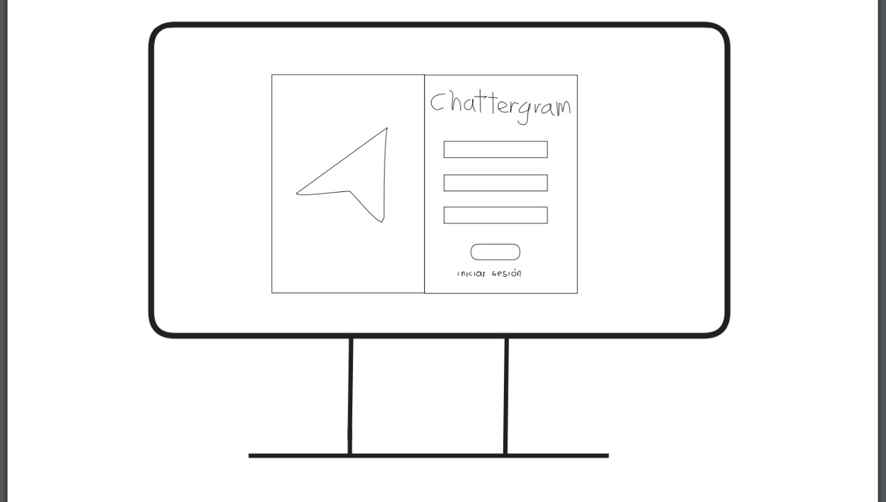
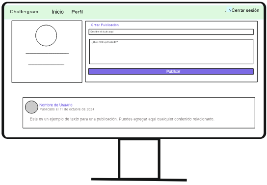
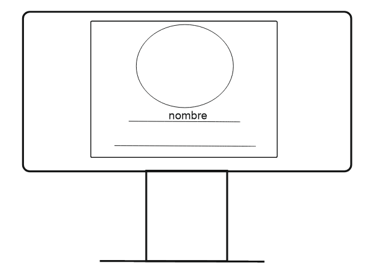

# Chattergram 📲

Bienvenido a **Chattergram**, la red social que transforma la forma en que compartes experiencias y te conectas con otros. 🌟 Diseñada para fomentar interacciones auténticas, Chattergram ofrece una interfaz intuitiva y potentes funcionalidades para crear un espacio dinámico de discusión y conexión.

## 🚀 Características Destacadas

- **Interfaz Amigable**: Navegación fluida y atractiva que optimiza la experiencia del usuario.
- **Registro y Autenticación Segura**: Crea y gestiona tu cuenta con confianza.
- **Publicaciones y Comentarios**: Comparte pensamientos, publica contenido y participa en conversaciones significativas.
- **Interacción Social**: Da "me gusta" a publicaciones y descubre contenido popular entre amigos y la comunidad.

## 🧩 Proceso de Diseño

Chattergram fue diseñado partiendo de las necesidades y expectativas de los usuarios. Para ello, se definieron objetivos clave:

- **Conexión Significativa**: Crear una plataforma acogedora para el intercambio de ideas.
- **Facilidad de Uso**: Garantizar una experiencia intuitiva y accesible.
- **Seguridad y Privacidad**: Proteger la información personal del usuario.

### Etapas del Diseño

1. **Investigación y Planificación 🏋️‍♀️**: Identificamos el perfil del usuario y sus intereses para definir objetivos estratégicos (como el aumento de interacción y conocimiento de marca).
2. **Desarrollo del Prototipo 💻**: Inspirados en la estructura de Instagram, creamos un prototipo inicial que incorpora características esenciales de Chattergram.
3. **Implementación 🔎**: Usamos HTML, CSS, JavaScript, Bootstrap y Firebase para desarrollar y ajustar la aplicación según los resultados de pruebas de usabilidad.

## 📜 Historias de Usuario

1. **Como usuario nuevo**, quiero registrarme fácilmente para acceder a la plataforma y comenzar a compartir contenido.
2. **Como usuario**, quiero ver un feed de publicaciones en mi página principal para mantenerme al tanto de la actividad de la comunidad.
3. **Como usuario**, quiero comentar en publicaciones para interactuar y expresar mi opinión.
4. **Como usuario**, quiero dar "me gusta" a publicaciones para mostrar apoyo y reconocimiento a otros.

## Solución del Problema del Usuario 📢

- **Centralización de Información**: Asegura una experiencia segura mediante el uso de contraseñas y autenticación.
- **Datos Actualizados**: Ofrece información precisa y al día sobre las publicaciones en la plataforma.
- **Interfaz Intuitiva**: Mejora la navegación, permitiendo a los usuarios explorar y compartir experiencias de manera atractiva.

Chattergram facilita la conexión y el intercambio de historias y experiencias, fomentando una comunidad en la que se crean lazos de amistad y apoyo.

## 🎬 Historia de Chattergram

Chattergram fue creado tomando inspiración de X, lo cual brindó una base sólida para el diseño de nuestra estructura de datos y funciones. Con nuestro propio estilo y colores, Chattergram busca ser un espacio para que los usuarios compartan situaciones, gustos y hagan nuevas conexiones.

## 📌 Prototipos

### Prototipo de Baja Fidelidad 📝

| Página de Login | Página de Registro | Página Principal | Página de Perfil |
| --------------- | ----------------- | ---------------- | ---------------- |
|  |  |  |  |

### Prototipo de Alta Fidelidad 💻

| Página de Login | Página de Registro | Página Principal | Página de Perfil |
| --------------- | ----------------- | ---------------- | ---------------- |
|  |  |  |  |

## 🛠️ Tecnologías Utilizadas

## 👩‍💻 Creado por

- [Mishell Arroyo](https://github.com/Mishell-A)
- [Oriana Pirona](https://github.com/ori27-ops)
- [Florenzia Trujillo](https://github.com/Brizett-TB)
- [Guadalupe Campos](https://github.com/GuadalupeCampos)
- [Guadalupe Mauricio](https://github.com/guadalupe56-dot)
